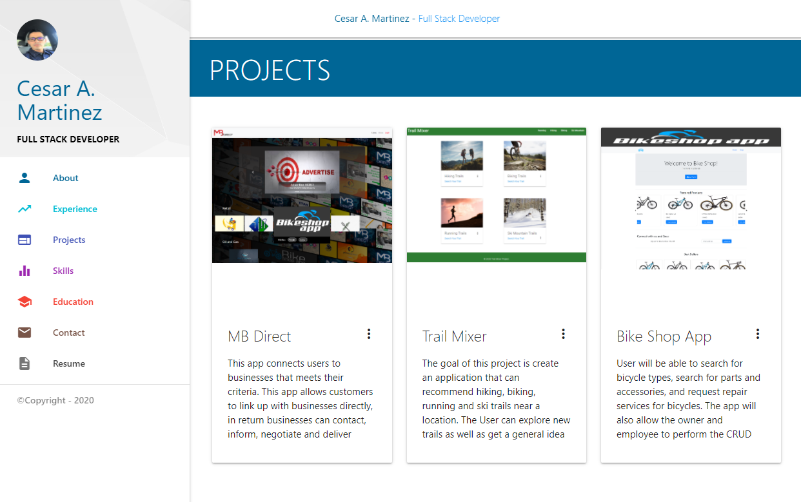

# Portfolio


Link : [Project Link](https://cesaraugustomartinez.github.io/my-portfolio/)

---

### Table of Contents

- [Description](#description)
- [How to Use](#how-to-use)
- [Screenshots](#screenshots)
- [References](#references)
- [License](#license)
- [Author Info](#author-info)

---

## Description

The goal of this app is the use of React and Materilize CSS Framework to create a mobile responsive portfolio. A Materialize grid system has been implemented to add styling which delivers a very good look to the user. Elements as container, rows, and columns were used in the develoment of this project as well. 

##### Technologies

- Html
- Javascript
- React.js
- Visual Studio Code
- CSS
- Materialize
- Material - UI

Code sample - React.js

``` js

  import React from 'react';
import ReactDOM from 'react-dom';
import './index.css';
import App from './App';

ReactDOM.render( 
    <App />,
  document.getElementById('root')
);

```

Code sample - Components in React

```js

import React, { useState} from "react";
import Container from "../components/Container/Container";
import Navbar from "../components/Navbar/Navbar";
import About from "../components/Sections/About";
import Contact from "../components/Sections/Contact";
import Education from "../components/Sections/Education";
import Experience from "../components/Sections/Experience";
import Intro from "../components/Sections/Intro";
import Projects from "../components/Sections/Projects";
import Skills from "../components/Sections/Skills";
import Modal from "../components/Modal/Modal";
function Home(props) {
  const [sidebar, setSidebar] = useState(true);
  const showSidebar = () => setSidebar(!sidebar);
  const [open, setOpen] = useState(false);  
  function handleClickOpen (){
    setOpen(true);
  };
  function handleClose () {
    setOpen(false);
  };

  return (
    <>
      <Navbar sidebar={sidebar} isActive={showSidebar} handleClickOpen={handleClickOpen}/>
      <Container sidebar={sidebar} isActive={showSidebar}>
        <Intro/> 
        <About/>
        <Experience/>
        <Projects/>
        <Skills/>
        <Education/>
        <Contact/>
        <Modal open={open} handleClose={handleClose}/>        
      </Container>

    </>
  );
}

export default Home;

```

Code sample - CSS

```css

.active {
      margin-left: 300px;
      transition: 0.2s;
  }

  header, main, footer {
    padding-left: 0px;
  }
  a {
    color: #009688;
  }
  .section {
    padding-bottom: 30px;
    padding-top: 0;
    position: relative;
  }
  .full-height {
    height: 100vh;
  }
  
```

---

## How To Use

This web application has different sections. These have different types of information. Each of them have elements like menu, photos, links, social media buttons. You can interact between these sections components going from one to oher one easy. Also you can access to them through mobile, desktop and tablet devices, having a responsive website. 

## Screenshots

- Experience page


- Projects page



- Skills page


- Resume to download


[Back To The Top](#Portfolio)

---

## References

- w3school -- [Bootstrap 4 Tutorial](https://www.w3schools.com/bootstrap4/)
- Materialize -- [Grid system](https://materializecss.com/)

[Back To The Top](#Portfolio)

---

## License

Copyright (c) [2020 - 2021] [Cesar A Martinez]

[Back To The Top](#Portfolio)

---

## Author Info

- Twitter -- [@cesaguma](https://twitter.com/cesaguma)
- Linkedin -- [Cesar A Martinez](https://www.linkedin.com/in/cesar-augusto-martinez-auquilla-03934a16b/)

[Back To The Top](#Portfolio)

